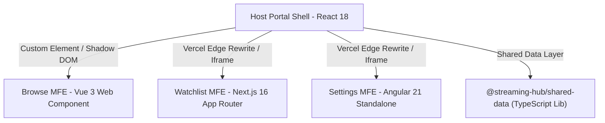

# 🎬 StreamHub — Enterprise Multi-Framework Micro-Frontend Streaming Platform

[](https://nx.dev/)
[](https://react.dev/)
[](https://vuejs.org/)
[](https://nextjs.org/)
[](https://angular.dev/)
[](https://vercel.com/)
[](https://www.docker.com/)

**StreamHub** is a state-of-the-art cinematic micro-frontend (MFE) streaming platform built within an **Nx Monorepo**. It unifies four distinct web technology stacks—**React**, **Vue 3**, **Next.js**, and **Angular**—into a single, high-performance streaming portal.

---

## 🌐 Live Demos

* 🚀 **Host Portal (Unified)**: [https://streaming-hub-host.vercel.app](https://streaming-hub-host.vercel.app)
* 🎬 **Browse MFE (Vue 3)**: [https://streaming-hub-browse.vercel.app](https://streaming-hub-browse.vercel.app)
* 📌 **Watchlist MFE (Next.js)**: [https://streaming-hub-watchlist.vercel.app](https://streaming-hub-watchlist.vercel.app)
* ⚙️ **Settings MFE (Angular)**: [https://streaming-hub-settings.vercel.app](https://streaming-hub-settings.vercel.app)

---

## 🏗️ Architectural Overview

StreamHub combines **ESM Web Components** and **Iframe Edge Rewrites** to maintain team autonomy while sharing a global state and authentication context:



### 🧩 Monorepo Applications & Libraries

| Application / Library | Technology | Architectural Role | Port / Route |
| :--- | :--- | :--- | :--- |
| **`apps/host`** | React 18, TanStack Query | **Host Portal Shell**: Manages global authentication, hero showcase, navigation header, and MFE lifecycle. | `http://localhost:4200` (`/`) |
| **`apps/browse`** | Vue 3, Vite | **Catalog Browse MFE**: Compiled as a native HTML5 Custom Element (`<streamhub-browse>`) with Shadow DOM CSS isolation. | `http://localhost:4201` (`/browse`) |
| **`apps/watchlist`** | Next.js 16 (App Router) | **Watchlist Queue MFE**: Manages user watch queues, dynamic content additions, and trailer playback. | `http://localhost:4203` (`/watchlist`) |
| **`apps/settings`** | Angular 21 | **Account & Telemetry MFE**: Enterprise SaaS dashboard featuring billing options, audio/video quality settings, active device sessions, and animated cluster telemetry. | `http://localhost:4202` (`/settings`) |
| **`libs/shared/data-access`** | TypeScript Library | **Shared Core**: Provides uniform TypeScript domain models, static movie catalog, and `window.postMessage` auth event bus. | Shared Package |

---

## 🔑 Key Features & Technical Highlights

* 🔒 **Cross-Framework Auth Gating**: Single sign-on portal using JWT token broadcasting via window `postMessage` and `localStorage` session fallback across frame boundaries.
* ⚡ **Zero-Latency State Synchronization**: Shared `@streaming-hub/shared-data` library guarantees synchronous data contracts across React, Vue, Next.js, and Angular.
* 📊 **Simulated & Containerized Telemetry**: Live network latency (P99 SLA), dynamic bitrate wave charts, and edge server health monitoring.
* 🌐 **Serverless Edge Proxies (Vercel)**: Configured path rewrites (`/browse`, `/settings`, `/watchlist`, `/_next`) to route all sub-apps seamlessly on Vercel without cross-origin CORS errors.
* 🐳 **Docker Compose Orchestration**: Includes Nginx reverse proxy configuration (`nginx.conf`) and containerized Grafana performance monitoring.

---

## 🚀 Getting Started

### 📋 Prerequisites
* [Node.js](https://nodejs.org/) (v18 or higher)
* npm (v9 or higher)

### 1. Installation
Clone the repository and install dependencies:
```bash
git clone https://github.com/parikshit0412/streaming-hub.git
cd streaming-hub
npm install
```

### 2. Run Local Development Mode
Start all 4 micro-frontend applications simultaneously in watch mode:

```bash
# Start Host Shell (React) — http://localhost:4200
npx nx serve host

# Start Browse MFE (Vue 3) — http://localhost:4201
npx nx serve browse

# Start Settings MFE (Angular) — http://localhost:4202
npx nx serve settings

# Start Watchlist MFE (Next.js) — http://localhost:4203
npx nx dev watchlist -- -p 4203
```

Open **[http://localhost:4200](http://localhost:4200)** in your browser. Default login credentials:
* **Email:** `user@streamhub.demo`
* **Password:** `password`

---

## 📦 Production Build & Local Preview Server

### 1. Monorepo Production Build
Build all 4 applications into optimized production bundles inside the `dist/` directory:
```bash
npm run build
```

### 2. Local Production Preview
Launch the Express-based local production preview server that mimics Vercel edge rewrites on a single origin:
```bash
npm run preview
```
Open **[http://localhost:8085](http://localhost:8085)** to preview the compiled production build locally.

---

## 🐳 Docker Deployment

To launch the micro-frontend suite and Grafana metrics via Docker Compose:

```bash
docker compose up -d --build
```

Access services:
* **Streaming Hub Portal**: `http://localhost:8088`
* **Grafana Telemetry**: `http://localhost:3000`

---

## ☁️ Render & Vercel Deployment Guides

- 🌐 **[Vercel Deployment Walkthrough](VERCEL_DEPLOY.md)**: Deploy individual MFEs with edge rewrites.
- 🚀 **[Render Docker Deployment Guide](RENDER_DEPLOY.md)**: Deploy the full monorepo as a single Docker Web Service on Render.

---

## 📄 License
Distributed under the MIT License. See `LICENSE` for details.