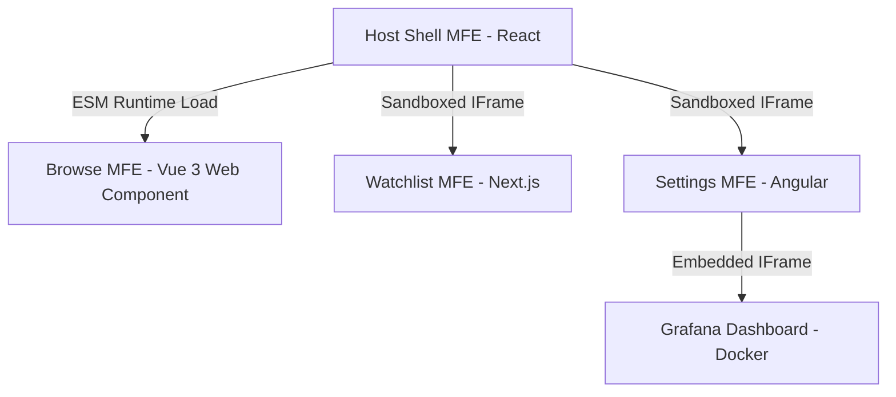

# 🎬 StreamHub: Monolithic Micro-Frontend Portal

StreamHub is a state-of-the-art cinematic micro-frontend (MFE) streaming portal built in a unified **Nx Monorepo**. It brings together four different frontend web technologies—**React**, **Vue 3**, **Angular**, and **Next.js**—as isolated applications that interact seamlessly under a single shell context, complete with containerized **Grafana** performance metrics.

---

## 🏗️ Architecture Overview

The workspace separates applications into dedicated runtime domains, using both **Web Components (Custom Elements)** for deep integration and **sandbox Iframes** for complete isolation:



### Monorepo Components
1. **Host App ([apps/host](file:///d:/ReactPlayProjects/project_one/streaming-hub/apps/host)):**
   * *Tech:* React, TanStack Query, Vanilla CSS variables.
   * *Role:* The shell portal. Provides the landing hero section, floating frosted-glass navbar, login gate, and mounts all sub-MFEs.
2. **Browse App ([apps/browse](file:///d:/ReactPlayProjects/project_one/streaming-hub/apps/browse)):**
   * *Tech:* Vue 3, Vite.
   * *Role:* Compiled as a native **HTML5 Custom Element** (`<streamhub-browse>`) loaded via ES Modules. Resolves assets cross-origin and encapsulates styling inside the Shadow DOM.
3. **Watchlist App ([apps/watchlist](file:///d:/ReactPlayProjects/project_one/streaming-hub/apps/watchlist)):**
   * *Tech:* Next.js (Turbopack), local persistence.
   * *Role:* An interactive queue dashboard featuring card trailers, queue metrics, and a dynamic add-movie form.
4. **Settings App ([apps/settings](file:///d:/ReactPlayProjects/project_one/streaming-hub/apps/settings)):**
   * *Tech:* Angular (standalone components).
   * *Role:* Configures profile records and embeds live telemetry logs.
5. **Metrics App ([grafana](file:///d:/ReactPlayProjects/project_one/streaming-hub/grafana)):**
   * *Tech:* Docker, Prometheus, Grafana.
   * *Role:* Containers collecting live system metrics, embedded directly within the Angular settings view.

---

## 🔑 Security & Session Gating

Access to all sub-applications is gated behind a centralized credentials portal inside the Host app:

* **Login Credentials:** Default email is `user@streamhub.demo` with any password (minimum 6 characters). The password field includes a visibility toggle (`👁️` / `🙈`).
* **Token Propagation:** On successful authentication, the Host stores the session in `localStorage` and publishes a `STREAMHUB_AUTH` event to window listeners.
* **MFE Access Gates:** If any sub-app (Vue, Angular, Next.js) is accessed inside the Host before the user signs in, the viewport blocks interaction and renders a glowing, spinning loader card indicating **"🔒 Access Gated via Host"**.
* **Bypass for Standalone:** For developer ergonomics, running any MFE standalone directly (e.g. `http://localhost:4203`) displays a warning banner and bypasses authentication.

---

## 🚀 Getting Started

### 📋 Prerequisites
* [Node.js](https://nodejs.org/) (v18+)
* [Docker Desktop](https://www.docker.com/) (to run Grafana metrics)

### 1. Installation
Clone the repository and install dependencies:
```bash
git clone https://github.com/parikshit0412/streaming-hub.git
cd streaming-hub
npm install
```

### 2. Launch Local Dev Servers
To start the entire MFE workspace simultaneously, launch the dev targets:
```sh
# Start the React Host Shell (Port 4200)
$env:NX_DAEMON="false"; node node_modules/nx/dist/bin/nx.js serve host

# Start the Vue Browse MFE (Port 4201)
$env:NX_DAEMON="false"; node node_modules/nx/dist/bin/nx.js serve browse

# Start the Angular Settings MFE (Port 4202)
$env:NX_DAEMON="false"; node node_modules/nx/dist/bin/nx.js serve settings

# Start the Next.js Watchlist MFE (Port 4203)
$env:NX_DAEMON="false"; node node_modules/nx/dist/bin/nx.js dev watchlist -- -p 4203
```
*Once loaded, open your browser and navigate to **[http://localhost:4200](http://localhost:4200)**.*

### 3. Launch Grafana Metrics (Docker)
Start the pre-configured telemetry metrics suite:
```sh
docker compose up -d --build
```
*This serves the embedded dashboard on **`http://localhost:3000`** with anonymous viewing enabled.*

---

## 📦 Production & Deployment

The monorepo includes production configurations optimized for deployment behind the configured **Nginx proxy** (`nginx.conf`):

### 1. Production Build
To compile and build all applications into highly optimized production assets under the `dist/` directory:
```sh
$env:NX_DAEMON="false"; node node_modules/nx/dist/bin/nx.js run-many --target=build
```
*Note: Filename hashes are disabled for the Vue Browse bundle so that the Host app can reliably import `/browse/assets/index.js` in production.*

### 2. Environment Configurations
The Host application automatically switches endpoints depending on the active environment (`NODE_ENV`):
* **Development:** Loads MFEs from isolated ports (`http://localhost:4201`, etc.) to support hot reloading.
* **Production:** Loads MFEs from relative paths (`/browse`, `/settings`, `/watchlist`) configured under the unified Nginx proxy to resolve cross-origin policies.